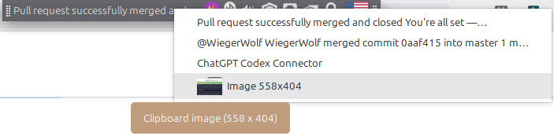

```sh
sudo apt install meson build-essential cmake libgtk-3-dev libxfce4panel-2.0-dev xfce4-clipman
meson setup build --prefix=/usr --libdir=lib/x86_64-linux-gnu
ninja -C build
sudo ninja -C build install
xfce4-panel --restart
```
